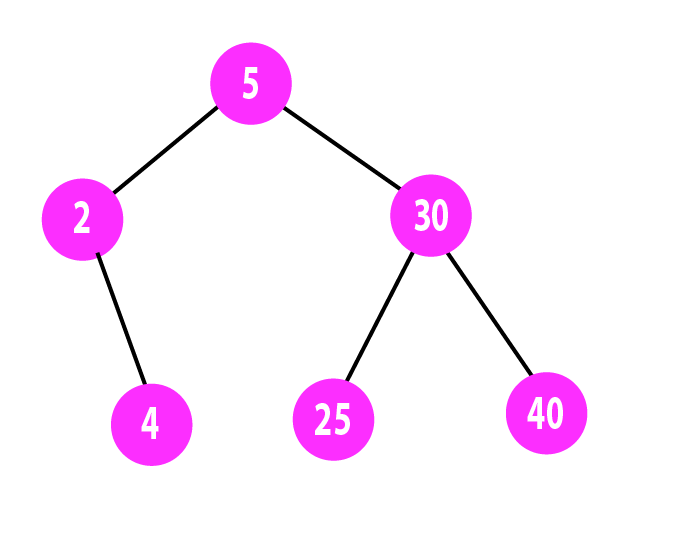

# Binary Tree Data Structure

 This repository contains a Data Structure assignment that was part of Module 1 (“Launching into Computer Science”) in my MSc in Computer Science at the University of Essex, UK. 

## Problem Statement:

Given the statement below, create a binary tree.
 
    x = BinaryTree ('a')
    insert_left(x,'b') 
    insert_right(x,'c')
    insert_right(get_right_child(x),'d')
    insert_left(get_right_child(get_right_child(x)),'e')

### => [Solution](https://github.com/alicevillar/Binary_Tree_Data_Structure/blob/main/main.py)

### Approach:

Here we have a Binary Tree called X. In this Binary Tree, the root node is ('a'), which has two sub nodes: [],[] - left and right, respectively. 

This can be described as: 
 
    ['a', [], []]

Here are the steps to find the correct representation of the tree:  

### Step 1: insert 'b'

Comand => insert_left (x,'b') 

The BinaryTree X is described as ['a', [], []].  Now we have to insert a node 'b' in the left side. As a result we will have: 

    ['a', ['b', [], []], []]

  
### Step 2: insert 'c'

Comand => insert_right (x,'c')

Now the Binary Tree X with a node 'c' in the right side can be described as:

    ['a', ['b', [], []], ['c', [], []]]
 
 
### Step 3: insert 'd'

Comand => insert_right(get_right_child(x),'d')

 Now we will insert 'd' in the right side. It will be the right side of  'c'. Now the Binary Tree can be described as: 

    ['a', ['b', [], []], ['c', [], ['d', [], []]]]

### Step 4: insert 'e'

Comand => insert_left(get_right_child(get_right_child(x)),'e')

Now we will insert 'e' as the left child of  'd'. This can be described as:

    ['a', ['b', [], []], ['c', [], ['d', ['e', [], []], []]]]

### Symmary 

Here is a summary with all the steps to build the Binary Tree X: 

Binary Tree X = ['a', [], []]

* Step 1 = ['a', ['b', [], []], []]
* Step 2 = ['a', ['b', [], []], ['c', [], []]]
* Step 3 = ['a', ['b', [], []], ['c', [], ['d', [], []]]]
* Step 4 = ['a', ['b', [], []], ['c', [], ['d', ['e', [], []], []]]]      =>   This is correct representation of the tree. 

The file main.py contains the Python Algorithm that return with this same representation of the Binary Tree X. Here is the output:
 
    ['a', [], []]
    ['a', ['b', [], []], []]
    ['a', ['b', [], []], ['c', [], []]]
    ['a', ['b', [], []], ['c', [], ['d', [], []]]]
    ['a', ['b', [], []], ['c', [], ['d', ['e', [], []], []]]]

### Graphic representation 

Here is a visual representation of the Binary Tree X after all the insertions: 
 
 
 
 ### Resources
 
GreeksforGreeks. (Sep, 2020). Binary Tree Data Structure. Available from: https://www.geeksforgeeks.org/binary-tree-data-structure/
 
Jenny's lectures CS/IT NET&JRF. 5.3 Binary Tree Implementation | Data Structures. Available from: https://www.youtube.com/watch?v=6vt3PFRC11E
 
mycodeschool. Data structures: Binary Tree. Available from: https://www.youtube.com/watch?v=H5JubkIy_p8&t=495s
 
